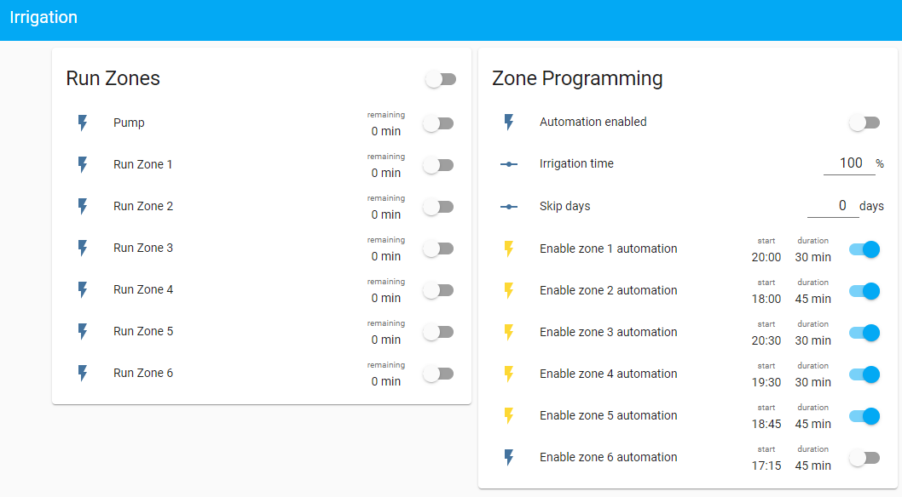

# Irrigation  with ESPHome and Home Assistant

## About
This package includes everything you need to setup an irrigation controller based on ESPHome and HomeAssistant. The automation runs entirely on the ESP device. Also the programming is persistently stored on the ESP device (even during a power-cycle). Home Assistant just provides the frontend to send the programmed values.



## Installation
This package includes three directories:

- **./esphome**

    This is the EspHome configuration file.
    Copy ```irrigation.yaml``` to your EspHome folder (```/esphome``` in your Home Assistant configuration folder if you use the EspHome Addon for Home Assistant).

    Make adjustments for your ESP device and Wifi and program your ESP device.

- **./config**

    These are the Home Assistant configuration files which include some helper entities and automations for the frontend.
    Copy everything to ```/packages/irrigation/config``` within your Home Assistant configuration folder.
    
    Add the following snippet to your ```configuration.yaml```:
    ```yaml
    homeassistant:
      packages:
        irrigation: !include_dir_merge_named packages/irrigation/config/
    ```

- **./dashboard**

    This folder contains an example for a lovelace dashboard shown in the picture above.

    Copy ```dashboard.yaml``` to ```/packages/irrigation/dashboard``` within your Home Assistant configuration folder.

    Add the following snippet to your ```configuration.yaml```:
    ```yaml
    lovelace:
        mode: storage
        dashboards:
            lovelace-yaml:
            mode: yaml
            title: Irrigation
            icon: mdi:sprinkler-variant
            show_in_sidebar: true
            filename: packages/irrigation/dashboard/dashboard.yaml
    ```
    **Note:**
    You need to install the [multiple-entites-row](https://github.com/benct/lovelace-multiple-entity-row) element and add it as a resource to your Home Assistant installation for the dashboard to function properly.

Restart Home Assistant so that the changes take effect.